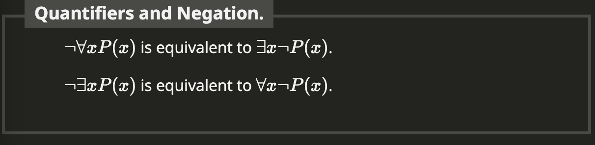

# Section 1.3 Notes on Rules of Logic

## Summary
- Logic studies the ways statements can interact with eachother
- The study of logic does not care about the content of the statements or the meaning of them. 
- In mathematics we often do know some relationship between atmoic statements.
- It helps when trying to understand complicated resoning, if we seperate the content from the logical form.
- We can use truth tables for complicated statements
- Tautologies are always true.
- The negation of a disjunction or conjunction is logically equivalent to a conjunction or disjunction of negations
- Boolean algebra can be used to transform one statement into another.
- You can have double negations stacked up.
- The negation of an implication is a conjunction
- We can pass the negation symbol over a quantifier, but that causes the quantifier to switch type.

- Predicate logic extends propositional logic

## Vocab
- **Truth Tables**: A chart that show the different truth values for a statement.
- **Tautology**: a statement that is necessarily true based on its logical form alone.
- **Logically Equivalent**: When P is true precisely when Q is true.
- **Deduction rule**: An argument that is always valid. 
