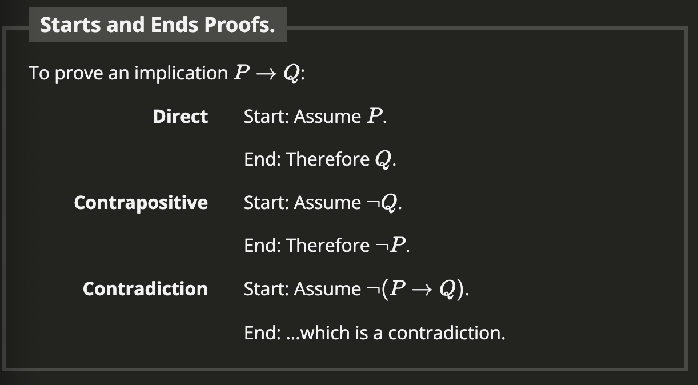

# Section 1.4 Proofs

## Summary
- There is cretivity in math
- There is no guaranteed path to success in the search for proofs.
- To write proofs you need inspiration and foundational techniques.
- All the proofs we consider must invole some combining of math concepts in addition to their logical structure
- Logical structure is the skeleton or scaffolding of the proof.
- A little paranoia when writing proofs is healthy.
- Due to the contrapositives truth value matching that of the original statement, we can prove the contrapositive instead of the original statement. 
- A proof by contradiction is a proof that assumes that one assumption is false and tries to construct a proof to that false solution.
- A proof by contradiction is like doing the other two proofs at the same time, and meeting in the middle.

## Vocab
- **Tautology**: is a necessarily true statement, but it does not tell us anything interesting
- **Direct Proof**: A way of showing truth or falsehood of a statement through a straghtforward combination of facts.