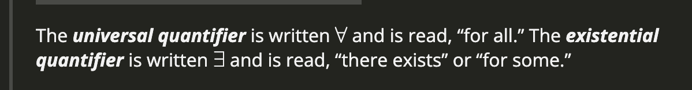

# Section 1.1 Logic & Proofs

## Notes
- To do mathematics, we need to be able to talk and write about mathematics
- The primary goal of mathematics is to establish general mathematic truths.
- A statement is atomic if it cannot be divided into smaller statements
- If it can be divided into smaller statements it is called molecular.
- A statement has to be either true or false or it is not a statement
- A predicate can be made into a (true or false) statement by evaluating it at some constants
- We don't have to be presice when we assume that sentences containing predicates with free variables are intended as statements

## Vocab

### premise
> All statements but the last in an argument

### conclusion
> The last statement in an argument

### argument
> A sequence of statements

### theorem
> A name for a general mathematical truth

### proposition
> A name for a general mathematical truth

### proof
> A valid argument to prove a mathematical truth

### statement
> A declarative sentence that is either true or false

### quantifier
>  A symbol indicatign the scope of the predicate

### predicate
> A statement containing variables

### logical connective
> The technical name for Logic gates in mathematics

### binary connective
> A logical connective that connects two statements

### unary connective
> A logical connective that applies to a single statement

### truth value
> A value indicating whether the statement is true or false 

### propositional variables
> Variables that are usually capital letters that stand in for statements.

### conjunction
> A statement formed by joining two statements with the connector AND

### disjunction
> A statement formed by joining two statements with the connector OR

### implication
> A statement formed where 'If P, then Q'

### conditional
> A statement formed where 'If P, then Q'

### biconditional
> A statement formed where 'P, if and only if Q'

### negation
> A statement where the truth value of a statement is swaped.

### truth conditions
> The outcome truth value of a statement after using logical connectives.
